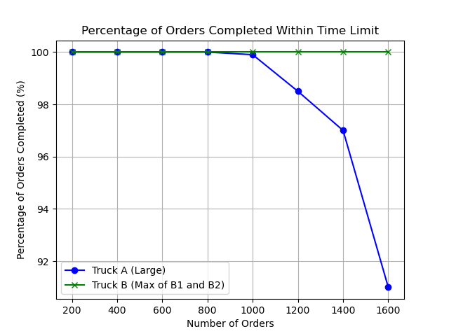
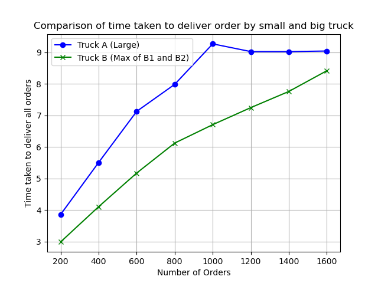

# Hypothesis 1

"Two smaller trucks(B) running simultaneously will deliver more number of packages on time as compared to one larger truck(A) in a day."

We will use map (**OSMX** libraray of python for map) of small area like **Champaign**. We would have X(order volume for that day) as number of packages(along with destination's latitude and longitude coordinates) to be delivered from a hub to destination(apartment's of people).

Now we will consider a truck A(bigger truck) which has capacity of 200 orders and 2 trucks B(smaller trucks) of capacity 100(half of larger truck) each.

Scenario 1-
Now our truck A will start from hub and start delivering packages in order. We would here calculate the time taken and determine number of packages that were delivered on time.
 
Scenario 2-
Similarly two trucks B will start from hub and start delivering packages in order and we would calculate the time taken by each truck and determine number of packages that were delivered on time.

By this calculation we aim to calculate, Number of orders possible to be delivered in a day(8am to 5pm), we would observe the results over different order volumes. At some order volume we expect both scenarios to start failing.

### Research Question:
One big truck or two small trucks which can deliver more number of orders on time in a day given fixed number of orders and same set of delivery locations

### Hypothesis:

#### Null Hypothesis:
2 smaller trucks (B) working simultaneously will be reliably better able to deliver more packages on time per day than using 1 larger (A) truck

#### Alternate Hypothesis:
The larger (A) truck working will be reliably better able to deliver more packages on time per day than using 2 smaller trucks (B) simultaneously.

### Random Variables-
1. Delivery locations - for every iteration we would randomly choose the delivery coordinates, this means the distance from hub for all delivery locations varies per iteration.
2. Distribution of parcels between two small trucks - The parcel distribution among two smaller trucks will be random.
3. traffic congestion - We are assuming that any given point there is by default 30% of chance for both trucks to experience traffic. We are using PERT distribution to determine traffic congestion factor.
4. Route (order of delivery points visited) - We are using greedy approach(nearest node from Hub) to determine the order of delivery points.

### Derived Variables-
Speed- We are extarcting the maximum speed from OSMnx graph but then we are multiplying with congestion factor to consider impact of traffic on speed.

Controlled variable-
Order volume for that day.

### Output variables-
1. Time taken for a particular location - total distance to reach a delivery location from last source(source can be hub if it is 1st location or it could be delivery location that was just delivered an order)/ speed for that particular route

2. Total time taken to deliver all orders- summation of time taken for all locations

If the time taken for that day is 8 hours or less and all orders are delivered then it is a succesful case where all orders were delivered on time.
If the time taken for that day is more than 8 hours then it is a failure as all orders were not delivered on time.

### Results:

Inference: Percentage of Orders Completed Within Time Limit (Plot 1):

Truck A (Large) starts to fail in completing orders on time as the number of orders exceeds 1000, with a significant drop after 1200 orders.
Truck B (2 Smaller Trucks) maintains a consistent 100% on-time delivery performance, regardless of the number of orders.

Inference: While Truck A (Large) initially delivers orders faster for lower order volumes, its delivery time plateaus and becomes less efficient beyond 1000 orders.
Truck B (2 Smaller Trucks) demonstrates a steady and more scalable increase in delivery time as order volumes rise, remaining comparatively efficient.

### Final Conclusion:

The results support the Null Hypothesis. **Two smaller trucks (B) working simultaneously are reliably better at delivering packages on time per day compared to one larger truck (A), especially as the number of orders increases.**