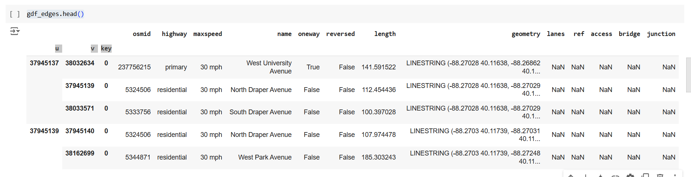

# Hypothesis 1

We will use map (**OSMX** libraray of python for map) of small area like **Champaign**. We would have X as number of packages(along with destination's latitude and longitude coordinates) to be delivered from a hub to destination(apartment's of people).

From OSMNX we have a column name as max speed. So, we will add a column name travel_time(=distance between two nodes/maxspeed). We will use this travel_time as weights for edges on the graph and will use it for finding the shortest path between two nodes.(in terms of least time taken)

Now we will consider a truck A(bigger truck) which has capacity of X and 2 trucks B(smaller trucks) of capacity X/2 each.

Scenario 1-
Now our truck A will start from hub and start delivering packages in order. We would here calculate the time taken and distance to deliver each package. 
 
Scenario 2-
Similarly two trucks B will start from hub and start delivering packages in order and we would calculate the time taken by each truck and distance covered by each truck

By this calculation we aim to calculate, Number of orders possible to be delivered in a day out of all the 800.

### Research Question:
One big truck or two small trucks which can deliver more number of orders in a day given fixed number of orders and same set of delivery locations

### Hypothesis:

#### Null Hypothesis:
2 smaller trucks (B) working simultaneously will be reliably better able to deliver more packages on time per day than using 1 larger (A) truck

#### Alternate Hypothesis:
W1 larger (A) truck working simultaneously will be reliably better able to deliver more packages on time per day than using 2 smaller trucks (B)