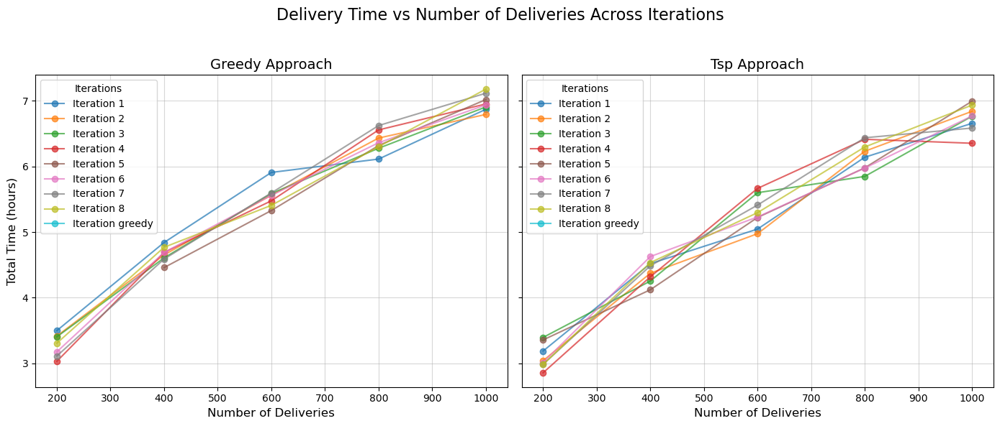
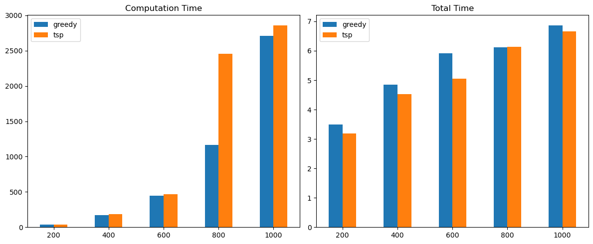

# Hypothesis 2

"The total time taken for completing deliveries is less using the travelling salesman problem route optimization approach than greedy route strategy but the as the number of deliveries volume increases the travelling sales problem approach takes a lot of computation time"

### Background
Greedy approach - Out of X number of delivery points, we will consider the point nearest to the hub as first delivery location. Then after delivering on first location, out of X-1 delivery points, we will consider the next nearest point from the current location of vehicle( which would be 1st delivery points)

Travelling sales man approach- Given a list of delivery locations and the distances between each pair of locations, what is the shortest possible route that visits each location exactly once and returns to the hub.
Reference - Travelling sales man problem-
https://en.wikipedia.org/wiki/Travelling_salesman_problem#:~:text=In%20the%20theory%20of%20computational,returns%20to%20the%20origin%20city%3F%22 

### Random variables-
1. Traffic Congestion
2. Delivery locations
3. Speed variability 

### Output-
1. Time taken for a particular location - total distance to reach a delivery location from last source(source can be hub if it is 1st location or it could be delivery location that was just delivered an order)/ speed for that particular route

2. Total time taken to deliver all orders- summation of time taken for all locations 

### Results-

Inference - The TSP approach results in lower total delivery time compared to the Greedy approach, especially for smaller delivery volumes (200-600 deliveries). However, the TSP approach shows higher variability as the delivery volume increases.

Inference - The TSP approach requires significantly more computation time than the Greedy approach, especially as delivery volume increases. Total time differences become marginal at higher volumes, though TSP still performs slightly better in total delivery time for smaller volumes.

### Conclusion - 
The TSP approach (larger truck) performs better in delivery time but incurs higher computation costs, while the Greedy approach (smaller trucks) is more computationally efficient, making it more suitable for larger delivery volumes. Hence, the Alternate Hypothesis holds for smaller volumes, but the Null Hypothesis may be more practical at larger volumes due to efficiency considerations.