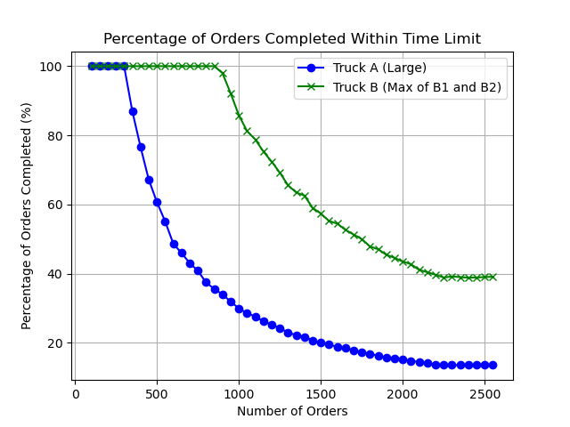
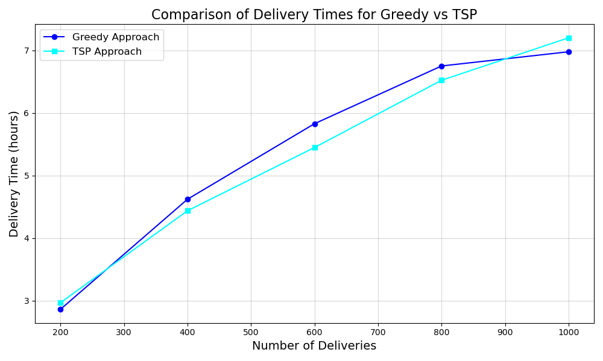
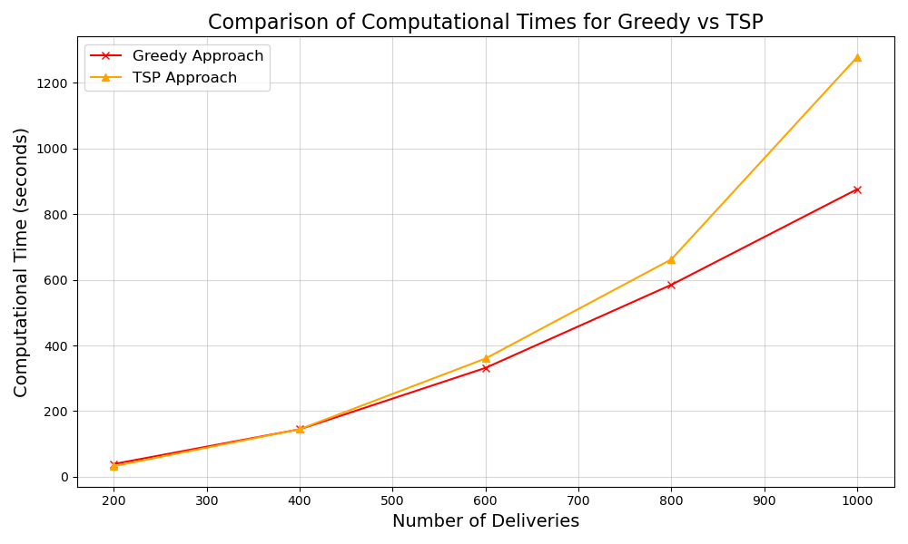

# Enhancing Logistic Delivery Strategies with Monte Carlo Simulation

### Introduction:

A logistic company has a large volume of deliveries to be completed in a day. The profits and reputation of the logistic company is concerned with how efficient it is in completing the volume of orders assigned to be delivered in a day. We in this project focus on observing how different factors could influence or impact the delivery perfomance and the time taken to complete all the deliveries and draw inferencesn on which strategies would work better to optimize the number of orders delivered in least amount of time possible.

### Research Questions and its Hypothesis

In our project we work on two research questions.

1. **Given two vehicle types, one big truck with capacity of 200 deliveries and two small truck with capacity of 100 deliveries which one will be more efficient for a logistic company?**

Hypothesis:
Ho: We expect that that 2 smaller trucks (B) working simultaneously will be reliably better able to deliver more packages on time per day than using 1 larger (A) truck

2. **Given two route deciding strategies one, greedy approach and other optimized Travelling Salesman Approach(TSP) of route optimization which strategy will work better for the logistic company in terms of time taken to deliver orders and computational time to calculate the route**

Hypothesis:
Ho: The total time taken for completing deliveries is less using the tsp route optimization approach than greedy route strategy but the as the number of deliveries volume increases the tsp_approach takes a lot of computation time

### Assumptions:

1. We have assumed that the logistic company in a day works from 8am - 5pm i.e. 8 hrs.
2. We have assumed there is no priority assigned to the order deliveries and each of the order have same priority levels
3. We have assumed that there are no accidents, road partitions or natural disasters taking place
4. We have assumed the season has no effect on the speed to reach a location.
5. We have assumed that big truck speed is 10kph less than small truck speed.

### Libraries Used:
* OSMNX
* Networkx
* Time
* Random
* Numpy
* Pandas
* Seaborn
* Matplotlib

### Random Variables
* Delivery Locations
* Traffic Congestion
* Assignment of Delivery locations to the two small trucks for hypothesis 2
* Speed Factore over the route after the traffic impact

### Approach:
* Graph Initialization and Preprocessing​
* Traffic Congestion Simulation​
* Hypothesis Approach
* Simulation Across Delivery Sizes and Iterations​ for the Hypothesis 
* Performance Metrics and Visualization​

### Results obtained currently for Hypothesis 1

### Results obtained currently for Hypothesis 2

### Paralle Processing Implementation
In order to increase computing performance and to make the program runner faster, this project has integrated parallel processing, which divides jobs across several processors. Utilizing Python's ProcessPoolExecutor allows different tasks, like separate computations or simulations, to run concurrently, greatly cutting down on execution time. This method guarantees the best possible use of system resources, which makes the solution effective and scalable for managing big datasets or computationally demanding tasks.
So for the hypothesis 1 we ran the truck A and truck B simulation together and similarly for hypothesis 2 we ran the greedy and tsp approach together parallelly

### Structure of the codebase:
* Utility.py
Containing all the basic functions which are reuseable for both the hypothesis

* Hypothesis1.py
Importing utilies and having Simulation functions and results for first hypothesis

* Hypothesis2.py
Importing utilies and having Simulation functions and results for second hypothesis

* Presentation.ipynb
Combined merged final file where in we will properly present the results and also write down our inferences as markdown, with the plots

### References:
* https://github.com/wenhaomin/LaDe

* https://github.com/samirsaci/last-mile

* https://github.com/austinlasseter/datasets-shipping-logistics

* https://santhoshm.hashnode.dev/optimising-last-mile-delivery-using-open-source

* https://networkx.org/documentation/stable/index.html

* https://osmnx.readthedocs.io/en/stable/

* https://docs.python.org/3/library/concurrent.futures.html 